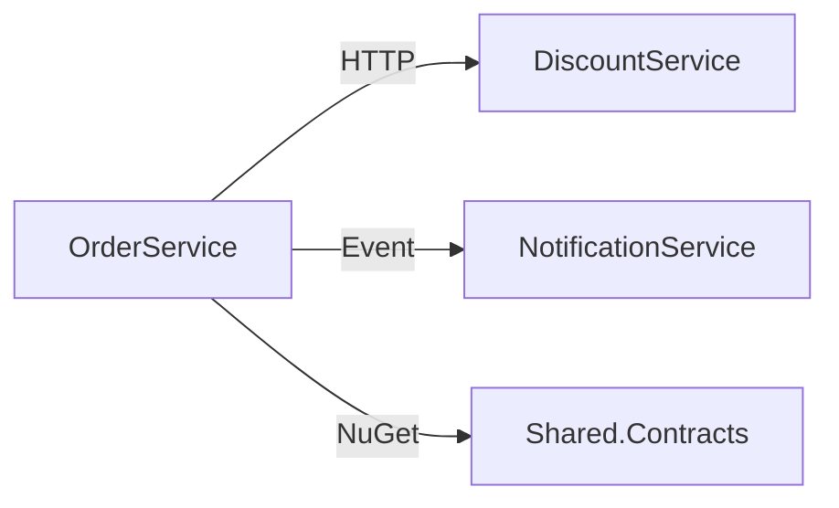

# Architecture Review Skill

Evaluate code changes against architectural fitness functions for a 120+ microservice .NET platform.

## Quick Usage

```
/arch-review                          # review current session's changes
/arch-review src/NewService/          # review a specific service
/arch-review --adr                    # also generate ADR for decisions made
/arch-review --coupling               # focus on coupling analysis
```

## Fitness Functions

### F1: Service Boundary Integrity

**Rule:** Each microservice owns its data. No shared databases. Communication via contracts only.

```
✅ ALLOWED:
ServiceA ──HTTP/gRPC──▶ ServiceB (via public API)
ServiceA ──Event──▶ ServiceB (via message broker)
ServiceA ──NuGet──▶ Shared.Contracts (shared DTOs/interfaces)

❌ FORBIDDEN:
ServiceA ──SQL──▶ ServiceB's database
ServiceA ──reference──▶ ServiceB.Internal namespace
ServiceA ──EF Context──▶ ServiceB's DbContext
```

Detection:
- Check `.csproj` for `<ProjectReference>` crossing service boundaries
- Check connection strings — does a service connect to another service's DB?
- Check namespace imports — does service A import service B's internal namespace?

### F2: Dependency Direction (Clean Architecture)

```
┌─────────────────────────────────────────┐
│ Presentation (Controllers, API)          │  ← depends on nothing below
│   ├── Application (Services, Handlers)   │
│   │   ├── Domain (Entities, Interfaces)  │  ← depends on NOTHING
│   │   │   └── Infrastructure (EF, HTTP)  │  ← implements Domain interfaces
└─────────────────────────────────────────┘

Allowed:
  Presentation → Application → Domain
  Infrastructure → Domain (implements interfaces)

Forbidden:
  Domain → Infrastructure
  Domain → Application
  Application → Presentation
```

Detection:
- Domain project `.csproj` must have ZERO `<PackageReference>` to EF Core, HTTP, MassTransit
- Domain classes must not `using` any Infrastructure namespace
- Interfaces live in Domain; implementations live in Infrastructure

### F3: Coupling Metrics

| Metric | Threshold | Action |
|--------|-----------|--------|
| Service fan-out (sync calls) | ≤ 6 | Warning at 5, block at 7+ |
| Service fan-in (dependents) | ≤ 10 | Warning at 8, evaluate decomposition at 12+ |
| Shared library consumers | ≥ 3 | If < 3 consumers, library is premature abstraction |
| Circular dependencies | 0 | Any cycle is blocking |
| Method cyclomatic complexity | ≤ 10 | Warning at 8, block at 15+ |
| Class line count | ≤ 300 | Warning at 200, split at 400+ |

Use graphify to measure:
```
/graphify query "What depends on OrderService?"
/graphify query "What is the fan-out of PaymentService?"
```

### F4: Data Ownership & Consistency

| Pattern | When to Use |
|---------|------------|
| Single owner (one service writes) | Default for all data |
| Saga / Process Manager | Multi-service transactions |
| Event Sourcing | Audit trail required, complex state machines |
| CQRS | Read/write asymmetry > 10:1 |
| Eventual consistency | Cross-service data that can be stale by seconds |

Detection:
- Multiple services writing to the same logical entity? → violation
- Direct DB access to foreign service's tables? → violation
- Missing idempotency on event consumers? → risk

### F5: API Contract Stability

**Breaking change detection:**
| Change Type | Breaking? | Migration Path |
|-------------|-----------|----------------|
| Remove field from response | YES | Deprecate → dual-write → remove |
| Rename field | YES | Add new, keep old, migrate consumers |
| Add required field to request | YES | Make optional with default |
| Add optional field to request | NO | Safe |
| Add field to response | NO | Safe (if consumers ignore unknown) |
| Change field type | YES | New endpoint version |
| Remove endpoint | YES | Deprecation header → sunset period |

Detection:
- Compare DTO changes against contracts consumed by other services
- Check if `[Required]` was added to existing request fields
- Check if response fields were removed or renamed

### F6: Scalability Patterns

| Pattern | Required When |
|---------|-------------|
| Pagination | Any list endpoint returning > 20 items |
| Caching | Same data read > 100x per write |
| Circuit breaker | Calling external/unreliable service |
| Retry with backoff | Network calls that may transiently fail |
| Idempotency key | Any non-read operation that may be retried |
| Outbox pattern | Publishing events alongside DB writes |

### F7: Observability

Every service MUST have:
- [ ] `/health` endpoint (liveness)
- [ ] `/ready` endpoint (readiness — checks DB, message broker connectivity)
- [ ] Structured logging with correlation ID in all log entries
- [ ] Distributed tracing spans for cross-service calls
- [ ] Metrics for business operations (counters, histograms)
- [ ] Alerting rules for error rates

### F8: Deployment Independence

| Check | Requirement |
|-------|-------------|
| Database migrations | Backwards-compatible (expand/contract) |
| Shared contracts | Additive only; breaking = new major version |
| Feature flags | Risky features behind flags |
| Statelessness | No in-memory state shared between instances |
| Config externalization | No environment-specific values in code |

## Analysis Workflow

1. **Identify change scope** — which services, which layers
2. **Map dependencies** — use graphify for service graph
3. **Evaluate each fitness function** — pass/warn/fail
4. **Compare with precedent** — how does the rest of the platform handle this?
5. **Generate verdict and recommendations**

## Output Format

```markdown
# Architecture Fitness Report

## Service Topology


## Fitness Function Results
| # | Function | Status | Score | Finding |
|---|----------|--------|-------|---------|
| F1 | Service boundary | ✅ | 10/10 | Clean separation |
| F2 | Dependency direction | ✅ | 10/10 | Domain pure |
| F3 | Coupling | ⚠️ | 7/10 | Fan-out = 6 (approaching limit) |
| F4 | Data ownership | ✅ | 10/10 | Single writer |
| F5 | Contract stability | ✅ | 10/10 | Additive only |
| F6 | Scalability | ⚠️ | 6/10 | Missing circuit breaker |
| F7 | Observability | ❌ | 3/10 | No health checks |
| F8 | Deploy independence | ✅ | 9/10 | |

**Overall: 75/80 — ⚠️ Approved with recommendations**

## Critical Issues
[must fix before merge]

## Recommendations
[should address within sprint]

## ADR (if --adr)
[generated Architecture Decision Record]
```
